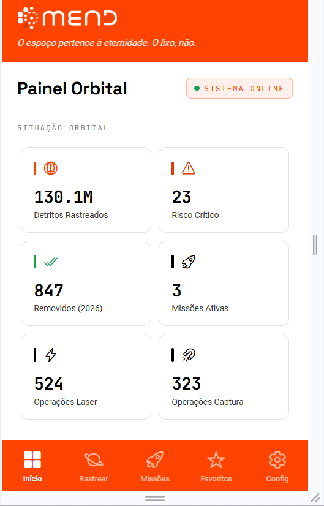
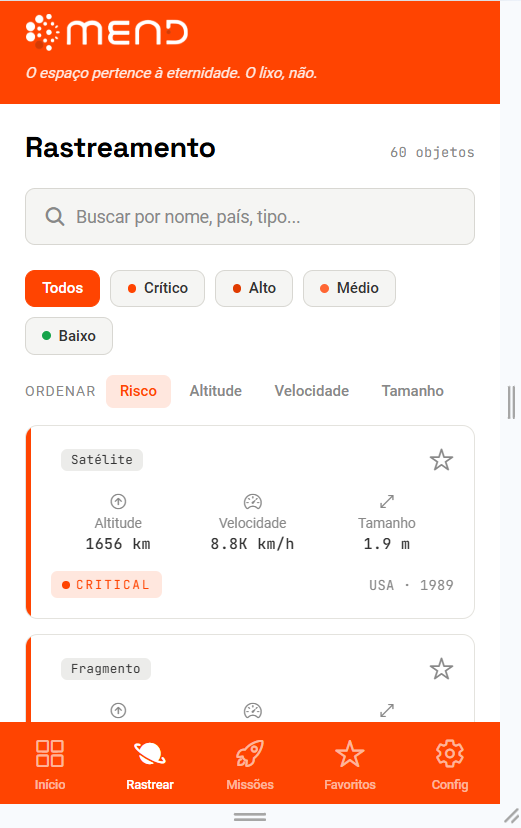
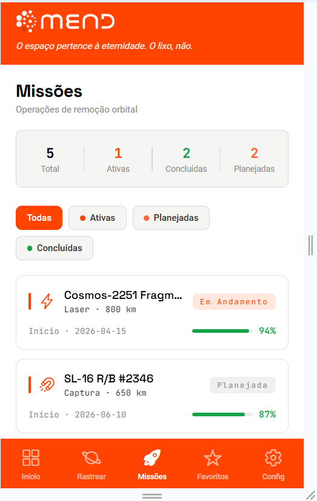
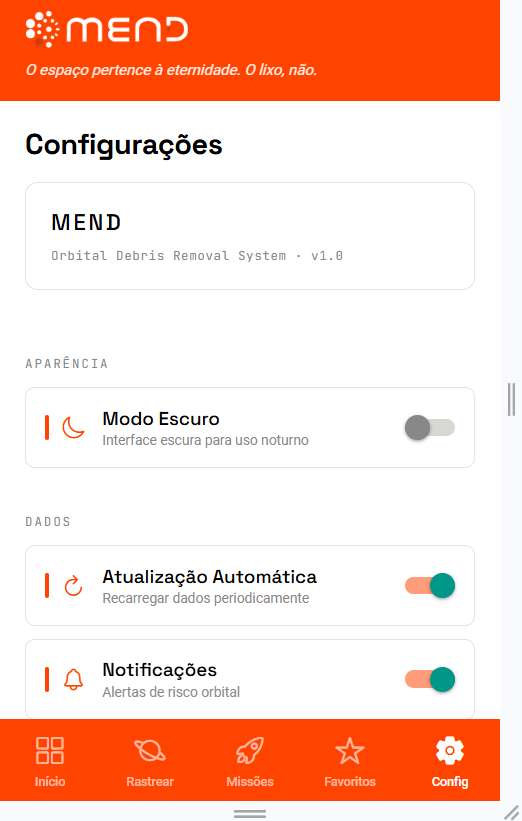

# 🛸 MEND — Orbital Debris Removal System

> *"O espaço pertence à eternidade. O lixo, não."*

Aplicativo mobile desenvolvido em React Native + Expo SDK 55 + TypeScript para a **FIAP Global Solution 2026 — Space Connect Challenge**.

---

## 🎬 Antes de tudo: assista ao nosso Pitch

> **Menos de 6 minutos que mudam a forma como você olha pro céu.** 🌌
>
> Toda noite, 130 milhões de fragmentos cruzam a órbita a 28.000 km/h. Nós decidimos fazer algo a respeito — e queremos te mostrar como.
>
> ### ▶️ **[CLIQUE AQUI E ASSISTA AO PITCH DA MEND »](LINK-DO-PITCH-AQUI)**
>
> *Sem spoilers. Só aperta o play e deixa a gente te levar até a órbita baixa.* 🛰️

---

## 📱 Sobre o Projeto

O **MEND** é um sistema de remoção de detritos orbitais que combina **laser de ablação** e **garras de captura** para limpar a órbita terrestre baixa (LEO). Este aplicativo mobile é a interface de monitoramento e controle do sistema, consumindo dados reais da **NASA API**.

### O Problema
- **130 milhões** de fragmentos orbitais em LEO
- Satélites mortos levam **80 anos** para cair naturalmente
- Síndrome de Kessler: reação em cadeia de colisões
- Starlink realizou **50.000 manobras de desvio** em apenas 6 meses de 2024

### A Solução MEND
- Sistema orbital reutilizável (laser + garras)
- Reduz tempo de reentrada de **80 anos para 3 anos**
- Mercado de **$13,5 bilhões** até 2035

---

## 🌱 Alinhamento com ODS da ONU

| ODS | Objetivo |
|-----|----------|
| 🏭 ODS 9 | Indústria, inovação e infraestrutura |
| 🏙️ ODS 11 | Cidades e comunidades sustentáveis |
| 🌡️ ODS 13 | Ação contra mudança climática |
| 🌾 ODS 2 | Agricultura sustentável (satélites de monitoramento) |
| 📈 ODS 8 | Crescimento econômico inclusivo |

---

## 📱 Funcionalidades

### 🏠 Início (Home)
- Dashboard com estatísticas orbitais em tempo real
- Indicadores: total de detritos, risco crítico, missões ativas
- Banner de alerta com objetos de risco elevado
- Resumo das missões MEND ativas
- Dados da NASA NeoWs API

### 🌐 Rastreamento
- Lista completa de objetos orbitais rastreados (dados NASA)
- Busca por nome, país e tipo
- Filtros por nível de risco (crítico, alto, médio, baixo)
- Ordenação por risco, altitude, velocidade ou tamanho
- Cards com informações detalhadas + sistema de favoritos

### 🚀 Missões
- Lista de missões MEND (laser, captura, combinado)
- Filtros por status (ativas, planejadas, concluídas)
- Barra de progresso de probabilidade de sucesso
- Estatísticas consolidadas

### ⭐ Favoritos
- Objetos salvos localmente com AsyncStorage
- Persistência entre sessões
- Opção de limpar todos os favoritos

### ⚙️ Configurações
- Alternância Dark/Light mode
- Ativação de notificações e atualização automática
- Seleção de unidades (métrico/imperial)
- Informações sobre o projeto

---

## 🧱 Estrutura do Projeto

```
MendApp/
├── App.tsx
├── src/
│   ├── components/
│   │   ├── StatCard.tsx
│   │   ├── DebrisCard.tsx
│   │   ├── MissionCard.tsx
│   │   └── LoadingScreen.tsx
│   ├── screens/
│   │   ├── HomeScreen.tsx
│   │   ├── TrackingScreen.tsx
│   │   ├── MissionsScreen.tsx
│   │   ├── FavoritesScreen.tsx
│   │   └── SettingsScreen.tsx
│   ├── navigation/
│   │   └── AppNavigator.tsx
│   ├── services/
│   │   ├── nasaApi.ts
│   │   └── debrisService.ts
│   ├── hooks/
│   │   └── useDebris.ts
│   ├── contexts/
│   │   ├── ThemeContext.tsx
│   │   └── FavoritesContext.tsx
│   ├── storage/
│   │   ├── favoritesStorage.ts
│   │   └── settingsStorage.ts
│   ├── types/
│   │   └── index.ts
│   ├── theme/
│   │   ├── colors.ts
│   │   └── typography.ts
│   └── utils/
│       └── formatters.ts
```

---

## 🚀 Como Executar

### Pré-requisitos
- Node.js 18+
- npm ou yarn
- Expo Go app (Android/iOS) **ou** emulador

### Instalação

```bash
# Clone o repositório
git clone <url-do-repo>
cd MendApp

# Instale as dependências
npm install

# Inicie o projeto
npm start
```

### Executar no dispositivo

```bash
# Android
npm run android

# iOS
npm run ios

# Web
npm run web
```

Escaneie o QR code com o app **Expo Go** no seu celular.

---

## 🔌 APIs Utilizadas

| API | Descrição | Endpoint |
|-----|-----------|---------|
| NASA NeoWs | Near Earth Objects (detritos/asteroides) | `api.nasa.gov/neo/rest/v1/feed` |
| NASA APOD | Astronomy Picture of the Day | `api.nasa.gov/planetary/apod` |
| NASA DONKI | Solar Flares (clima espacial) | `api.nasa.gov/DONKI/FLR` |

> A chave `DEMO_KEY` já está configurada. Para produção, obtenha uma chave gratuita em [api.nasa.gov](https://api.nasa.gov).

---

## 🧠 Tecnologias

| Tecnologia | Versão | Uso |
|-----------|--------|-----|
| React Native | 0.76 | Framework mobile |
| Expo SDK | 55 | Build e ferramentas |
| TypeScript | 5.3 | Tipagem estática |
| React Navigation | 6 | Navegação (Tabs + Stack) |
| Axios | 1.7 | Consumo de APIs |
| AsyncStorage | 2.1 | Persistência local |
| Context API | — | Estado global |

---

## ✅ Requisitos Obrigatórios — Comprovação

> Checklist dos requisitos técnicos exigidos no enunciado da Global Solution e **onde cada um está implementado** neste projeto.

| Requisito | Status | Onde está |
|-----------|:------:|-----------|
| React Native + Expo | ✅ | `App.tsx`, `package.json` (Expo + React Native 0.76) |
| TypeScript | ✅ | 100% do código em `.ts/.tsx` · `tsc --noEmit` sem erros |
| Navegação (React Navigation) | ✅ | `src/navigation/AppNavigator.tsx` — Bottom Tabs + Native Stack |
| Consumo de API externa | ✅ | `src/services/nasaApi.ts` (NASA NeoWs via **Axios**) + `src/hooks/useDebris.ts` |
| Persistência local (AsyncStorage) | ✅ | `src/storage/favoritesStorage.ts` e `src/storage/settingsStorage.ts` |
| Componentização e arquitetura | ✅ | `src/` em 10 módulos (components, screens, services, hooks, contexts, storage, types, theme, navigation, utils) |
| Interface funcional + Dark Mode | ✅ | `src/contexts/ThemeContext.tsx` (claro padrão + toggle) · 5 telas |
| Execução Android / iOS / Web | ✅ | `package.json` → `npm run android` / `ios` / `web` (react-native-web) |
| README completo com instruções | ✅ | Este documento |
| Equipe (até 5, nome + RM) | ⬜ | Ver seção [Integrantes](#-integrantes) — *preencher* |

---

## 🏆 Critérios de Avaliação — Prova de Preenchimento

> Tabela oficial de avaliação (peso total **10,0**) com a **evidência concreta** de atendimento de cada critério.

| # | Critério | Peso | Status | Como atendemos / Evidência no código |
|---|----------|:----:|:------:|--------------------------------------|
| 1 | **Estrutura e Organização** | 1,0 | ✅ | Arquitetura em camadas dentro de `src/`: `components/`, `screens/`, `navigation/`, `services/`, `hooks/`, `contexts/`, `storage/`, `types/`, `theme/`, `utils/`. Separação clara de responsabilidades. |
| 2 | **React Native + TypeScript** | 1,0 | ✅ | 100% tipado (interfaces centrais em `src/types/index.ts`). Componentes reutilizáveis: `StatCard`, `DebrisCard`, `MissionCard`, `AppHeader`, `MonthlyChart`. Hooks e props tipadas. |
| 3 | **Navegação** | 0,5 | ✅ | `React Navigation` (Bottom Tabs + Native Stack) em `src/navigation/AppNavigator.tsx`, conectando 5 telas (Início, Rastreamento, Missões, Favoritos, Configurações). |
| 4 | **Consumo de API** | 1,5 | ✅ | Integração com a **NASA NeoWs API** via **Axios** (`src/services/nasaApi.ts`), tratada por hook customizado com loading/erro/refresh (`src/hooks/useDebris.ts`). |
| 5 | **Persistência Local** | 1,0 | ✅ | **AsyncStorage** persistindo favoritos (`favoritesStorage.ts`) e configurações do usuário (`settingsStorage.ts`) entre sessões. |
| 6 | **Interface (UI/UX)** | 2,0 | ✅ | Identidade aeroespacial (ref. ClearSpace): **Light mode padrão + Dark mode**, header/menu laranja, fontes JetBrains Mono (telemetria) + Space Grotesk (títulos), gráfico SVG **responsivo** (`MonthlyChart`), cards, badges e estados de risco. Responsivo em Android/iOS/Web. |
| 7 | **Funcionalidades** | 1,5 | ✅ | Dashboard com estatísticas, listagem de objetos, **busca**, **filtros** por risco, **ordenação**, sistema de **favoritos**, missões com progresso e gráfico de desempenho mensal. |
| 8 | **Código e Boas Práticas** | 0,5 | ✅ | Service Layer, Context API, hooks customizados, utilitários de formatação (`utils/formatters.ts`), tipagem central e nomes semânticos. |
| 9 | **Criatividade e Inovação** | 1,0 | ✅ | Conceito **MEND** (laser de ablação + garras de captura) com dados **reais da NASA**, narrativa de mercado (Mend Credits) e alinhamento aos **ODS da ONU**. |
| | **TOTAL** | **10,0** | ✅ | Todos os critérios atendidos com evidência rastreável. |

---

## 📸 Demonstração

| Início | Rastreamento | Missões | Configurações |
|:------:|:------------:|:-------:|:-------------:|
|  |  |  |  |

🎥 **Pitch / demo em vídeo:** [assista aqui](LINK-DO-PITCH-AQUI)

---

## 👥 Integrantes

| Nome | RM |
|------|----|
| Fabiano Zague | 555524 |
| Lorran Sarmento | 558982 |
| Maria Oliveira | 557478 |
| Pedro Certo | 556268 |
| Vinícius Matarelli | 555200 |

---

## 📚 Referências

- [NASA API](https://api.nasa.gov/)
- [ESA ClearSpace-1](https://www.esa.int/Space_Safety/Clean_Space/ClearSpace-1)
- [Kessler Syndrome - NASA](https://www.nasa.gov/mission/orbital-debris/)
- [Perfect JSAT Laser Deorbit](https://www.jsat.net/)
